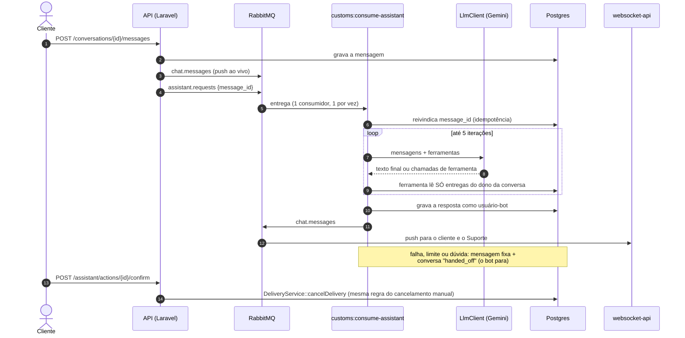

This repo contains the backend API for the Moonery system, built with Laravel.  
It features JWT authentication, RabbitMQ for messaging, request rate limiting, and follows **SOLID** and **DRY** principles for clean code.

## Assistente de IA no chat

O cliente conversa com o Suporte por um canal único. Antes de a mensagem chegar a um humano, um
**assistente** responde perguntas sobre as entregas do próprio cliente ("onde está?", "posso
cancelar?") usando ferramentas, e **encaminha ao Suporte** quando não sabe. A única ação possível
é cancelar, e só depois de um clique de confirmação. Detalhes e decisões:
[`docs/assistant-decision-log.md`](docs/assistant-decision-log.md).

### Como funciona

- **Ferramentas** (`app/Assistant/Tools`): `list_my_deliveries`, `get_delivery`,
  `can_cancel_delivery`, `request_cancel_delivery`, `handoff_to_support`. O usuário vem da
  conversa, nunca dos argumentos do modelo; entrega de outro cliente responde igual a entrega
  inexistente. O escopo está no **código** das ferramentas, não no prompt: trocar o modelo por um
  mais fraco não abre brecha.
- **Cancelar não é uma ferramenta.** `request_cancel_delivery` só deixa uma confirmação pendente
  (com validade). Quem cancela é `POST /api/assistant/actions/{id}/confirm`, disparado pelo
  usuário, pelo mesmo `DeliveryService::cancelDelivery()` do cancelamento manual — então
  `picked_up`/`in_transit` continuam barrados pela máquina de estados.
- **Provedores** atrás de `LlmClient`: hoje `GeminiLlmClient` (REST, `Http::`, sem SDK). O laço de
  ferramentas é nosso (`AssistantRunner`). Espaçamento entre chamadas, retry com backoff e tetos
  diários vivem em `GuardedLlmClient`, para qualquer provedor.
- **Quando para:** o assistente encaminha (`handoff_to_support`), qualquer falha/limite/teto cai
  numa mensagem de *fallback* + encaminhamento, e a resposta de um humano do Suporte silencia o bot.

### Configuração

Chaves em `.env.example` (sem valor): `ASSISTANT_PROVIDER`, `ASSISTANT_MODEL`, `GEMINI_API_KEY`,
`ASSISTANT_GEMINI_MIN_INTERVAL_MS`, `ASSISTANT_GEMINI_MAX_RETRIES`, `ASSISTANT_GEMINI_DAILY_CAP` e
as demais em `config/assistant.php`.

Num banco já existente: `php artisan migrate` e
`php artisan db:seed --class=AssistantSeeder` (cria o usuário-bot, a role `Assistant` e a
permissão `assistant.use`). O consumidor é o serviço `assistant-consumer` do `docker-compose.yml`;
**sem ele, as mensagens publicadas em `assistant.requests` se perdem** (a fila só passa a existir
quando ele sobe).

> **Privacidade:** a camada gratuita do Gemini pode usar entradas e saídas para melhorar modelos.
> Em desenvolvimento use **só dados de seed**, nunca dados reais de clientes.

### Testes

`docker compose exec laravel php artisan test`: nenhum teste chama a rede nem precisa de chave
(`FakeLlmClient` roteirizado e `Http::fake()`). A suíte do assistente cobre isolamento entre
clientes, argumentos forjados, injeção de prompt (na mensagem e em resultado de ferramenta),
cancelamento só com confirmação, idempotência, retry/backoff/espaçamento/tetos e silêncio.
