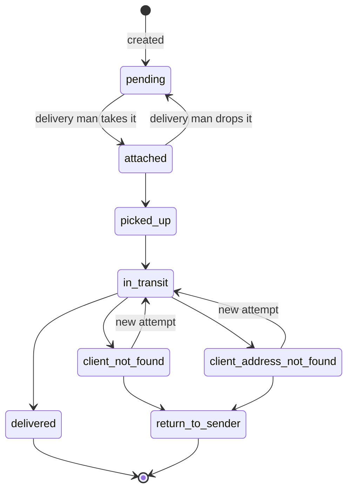
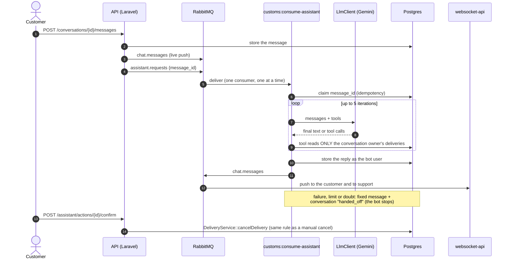

# Moonery API


The backend of **Moonery**, a delivery management platform. It owns the business rules (who may do what to a delivery, and in which order), publishes events to RabbitMQ, and runs the AI assistant that answers customers in the support chat.

> **Running it?** Start from the [`infra` repository](https://github.com/moonery-system/infra#readme): it brings up the whole stack. This README explains what is inside the API.

## Why it is interesting

- **A delivery state machine driven by one table**, with three independent questions (action allowed? move legal? delivery yours?), so no code ever branches on a role name.
- **Race-safe assignment**: two delivery men cannot take the same delivery (conditional `UPDATE`, affected rows checked).
- **Event-driven side effects**: e-mails, live notifications, chat push and the AI assistant all hang off RabbitMQ events, so the request that changes a delivery stays fast.
- **An AI assistant with hard limits** by design: scoped tools, confirmation before any action, and a human hand-off on any failure.
- **Quality gates**: 136 feature tests that need no network and no API key, PHPStan level 5 with no baseline, CI on every push to `master` and every pull request.

## The delivery lifecycle



**Cancelling** is a separate axis: the **client** may cancel while `pending` or `attached`; an **admin** until `in_transit`; **support** from any non-final state. `delivered`, `return_to_sender` and the three `canceled_*` states are final.

Each move is checked by [`DeliveryTransitionValidator`](app/Services/DeliveryTransitionValidator.php), the single source of truth: every target declares the permission it needs and the actor allowed (anyone, the owning client, the owning delivery man). Every change also writes an immutable row to the delivery's status history, which feeds the timeline in the UI.

## Roles and permissions

Authorization is **by permission string** (`deliveries.cancel`, `chat.viewAll`, …) resolved through a Laravel `Gate`, never by role name.

| Role | Can do |
|---|---|
| **Admin** | Everything |
| **Client** | View own deliveries, cancel before pickup, chat, use the assistant |
| **Delivery man** | See free deliveries, take one, advance its status, report failures and returns |
| **Support** | Read all deliveries, cancel as support, answer every chat. Cannot edit registrations |
| **Assistant** | A bot user with **no permissions at all**, so it can never enter the support side of a chat |

Rows outside a user's scope answer **404, not 403**: a 403 would confirm the row exists.

## Architecture

```
Route (middleware can:*)
  → FormRequest       validation
  → Controller        thin, only orchestrates
  → Service           business rules
  → Repository        data access, always behind an interface (Contracts/Repositories)
```

- Responses always go through one `ApiResponse` envelope; business-rule errors are a `BusinessException` rendered as **409**.
- Every write is audited through `LogService`.
- **JWT** in an httpOnly, `Secure`, `SameSite=Strict` cookie (60 min) with a refresh endpoint; login never returns the token in the body.
- Notifications are built with Strategy + Factory and published as events.

### Messaging

The API publishes small events (ids only) to a topic exchange, `delivery.events`; consumers re-read what they need (*claim check*).

| Routing key | Consumer | Purpose |
|---|---|---|
| `invites.email`, `notifications.email` | `customs:consume-emails` | Invite, password-reset and notification e-mails |
| `notifications.websocket`, `chat.messages` | Hyperf WebSocket service | Live push to the browser |
| `assistant.requests` | `customs:consume-assistant` | The AI assistant answers a chat message |

## The AI assistant

A customer talks to support through a single channel. Before the message reaches a human, an **assistant** answers questions about *that customer's own deliveries* ("where is it?", "can I cancel?") using tools, and **hands off to support** when it does not know. The only action it can trigger is cancelling, and only after the customer clicks a confirmation. Decisions and mistakes, dated: [`docs/assistant-decision-log.md`](docs/assistant-decision-log.md).



### How it stays safe

- **Tools** (`app/Assistant/Tools`): `list_my_deliveries`, `get_delivery`, `can_cancel_delivery`, `request_cancel_delivery`, `handoff_to_support`. The user comes from the conversation, **never from the model's arguments**. Another customer's delivery answers exactly like a missing one. The scope is in the **tool code**, not in the prompt, so swapping in a weaker model cannot open a hole.
- **Cancelling is not a tool.** `request_cancel_delivery` only leaves a pending confirmation (with an expiry). The customer's click calls `POST /api/assistant/actions/{id}/confirm`, which runs the same `DeliveryService::cancelDelivery()` as a manual cancel, so `picked_up`/`in_transit` stay blocked by the state machine. The confirmation text is fixed: the model cannot claim something was cancelled when it was only asked.
- **Providers sit behind `LlmClient`**: today `GeminiLlmClient` (plain REST over Laravel's `Http`, no SDK). The tool loop is ours (`AssistantRunner`). Call spacing, retry with backoff and daily caps live in `GuardedLlmClient`, so they work for any provider.
- **It stops** when the assistant hands off, on any failure, limit or cap (fixed fallback message plus hand-off), and when a human from support replies.
- **Idempotent**: one row per `message_id` in `assistant_runs`, so a redelivered message never gets a second answer.

### Configuration

Keys are in `.env.example` (no values): `ASSISTANT_ENABLED`, `ASSISTANT_PROVIDER`, `ASSISTANT_MODEL`, `GEMINI_API_KEY`, `ASSISTANT_GEMINI_MIN_INTERVAL_MS`, `ASSISTANT_GEMINI_MAX_RETRIES`, `ASSISTANT_GEMINI_DAILY_CAP`; the rest are in `config/assistant.php`.

On an existing database run `php artisan migrate` and `php artisan db:seed --class=AssistantSeeder` (creates the bot user, the `Assistant` role and the `assistant.use` permission). The consumer is the `assistant-consumer` service of the infra `docker-compose.yml`. **Without it, messages published to `assistant.requests` are lost**: the queue only exists once the consumer has started.

> **Privacy:** Gemini's free tier may use inputs and outputs to improve models. In development use **seed data only**, never real customer data.

## API overview

| Area | Endpoints |
|---|---|
| **Auth** | `POST /auth/login`, `/auth/refresh`, `/auth/logout`, `GET /auth/user`, invites (`GET`/`POST /invite`), `POST /auth/forgot-password`, `POST /changePassword` |
| **Deliveries** | `GET`/`POST /deliveries`, `GET`/`DELETE /deliveries/{id}`, `PUT /deliveries/{id}/status`, `POST /deliveries/{id}/cancel`, `POST`/`DELETE /deliveries/{id}/attach`, `PUT /deliveries/{id}/deliveryman` |
| **Clients** | `/clients` and `/clients/{id}/addresses` (CRUD) |
| **Users** | `/users` (CRUD), `GET /roles` |
| **Notifications** | `GET /notifications`, unread count, mark as read |
| **Chat** | `GET /conversations/me`, `GET /conversations` (support inbox), `POST /conversations/{id}/messages`, unread count, mark as read |
| **Assistant** | `POST /assistant/actions/{id}/confirm`, `POST /assistant/actions/{id}/reject` |

## Tests and quality

```bash
docker compose exec laravel php artisan test      # 136 feature tests
docker compose exec laravel composer analyse      # PHPStan level 5
```

- **136 feature tests** on a real PostgreSQL test database (`moonery_test`), covering the transition table, authorization by role, chat, and the assistant: client isolation, forged arguments, prompt injection (in the message and in a tool result), cancelling only with confirmation, idempotency, retries and caps, and silence.
- **No network and no API key needed**: a scripted `FakeLlmClient` and `Http::fake()` stand in for the model.
- **PHPStan level 5, no baseline**, enforced in CI along with the test suite and a lint step.
- Tests that "passed first time" were checked by **mutation** (break the code on purpose, confirm a test fails). One of those checks found a gap that sequential tests had hidden; the story is in the decision log.

## Known gaps

- Consumers have **no retry or dead-letter queue yet**: a failed e-mail is logged and dropped. This is the next piece of work.
- Laravel 9 is out of security support; upgrading is on the list.
- The audit log is written but there is no way to read it yet.
- `deliveries.scheduled_to` exists but scheduling was never decided.
